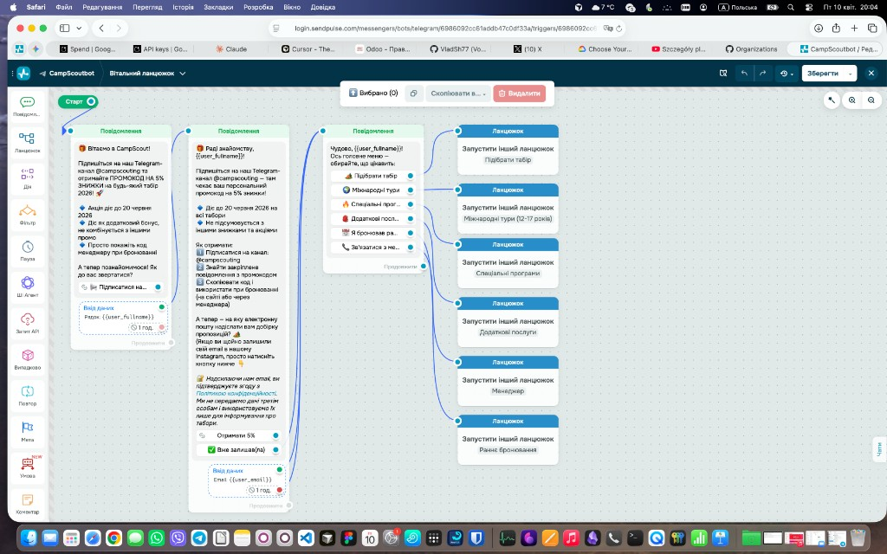

# SendPulse — CampScoutbot (Telegram): вітальний ланцюжок

Зафіксовано з **візуального конструктора SendPulse** (login.sendpulse.com) для узгодження з **омніканальним контуром**, міграційним мапінгом і **аналітикою відмов** (де користувач випадає: до імені, до email, після меню, по гілці).

**Скріншот потоку (оригінал збережено в репозиторії):**

---

## Метафора в SendPulse

| Елемент | Опис |
|--------|------|
| **Тип** | Telegram-бот **CampScoutbot** |
| **Режим** | Вітальний ланцюжок (Welcome flow), далі — **запуск інших ланцюжів** по кнопках меню |

---

## Лінійна частина (збір даних)

### Крок 1 — Старт → перше повідомлення

- Текст: вітання CampScout, посилання на **публічний** Telegram-канал **@campscouting**, знижка **−5%**, дійсна до **20.06.2026** (узгоджено з політикою «код у каналі», не персональна видача).
- Кнопка: підписка на канал (на кшталт «Підписатися на…»).
- **Ввід даних:** питання, як звертатися → змінна **`{{user_fullname}}`**.

### Крок 2 — друге повідомлення

- Персоналізація через **`{{user_fullname}}`**, повтор інструкції щодо коду (pinned / останній пост).
- Кнопки: на кшталт **«Отримати 5%»**, **«Вже залишав(ла)»** (точні підписи — як у конструкторі).
- **Ввід даних:** email для підбору оферів → **`{{user_email}}`**, з дисклеймером приватності.

### Крок 3 — головне меню

- Текст: підтвердження (на кшталт «Чудово, {{user_fullname}}!») + запрошення обрати пункт меню.
- Кнопки (6 пунктів — кожна веде в **окремий ланцюжок** *Launch another chain*):

  1. Підібрати табір  
  2. Міжнародні тури (у макеті зазначено вік **12–17**)  
  3. Спеціальні програми  
  4. Додаткові послуги  
  5. Зв’язатися з менеджером  
  6. Раннє бронювання  

---

## Мапінг на Odoo / omnichannel (орієнтир)

| SendPulse | Наш контур |
|-----------|------------|
| `{{user_fullname}}` | Ім’я / звертання → `res.partner`, `omni_addressing_*`, livechat pre-chat де застосовно |
| `{{user_email}}` | Email партнера / лід; узгодження з `omni_find_or_create_customer` |
| Окремі ланцюжки по меню | Еквівалентні **намірам / етапам** у діалозі (кваліфікація, handoff, каталог) — деталі в `docs/CAMP_MIGRATION_MAP_2026-04.md` та ТЗ §20 |

---

## Див. також

- Еталон UI розмови SendPulse в Odoo: [SENDPULSE_CONVERSATION_CARD_REFERENCE.md](./SENDPULSE_CONVERSATION_CARD_REFERENCE.md)

---

*Документ додано: 2026-04-10. Скрін: `docs/assets/sendpulse-campscoutbot-welcome-flow.png`.*
